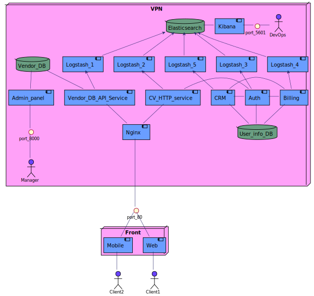
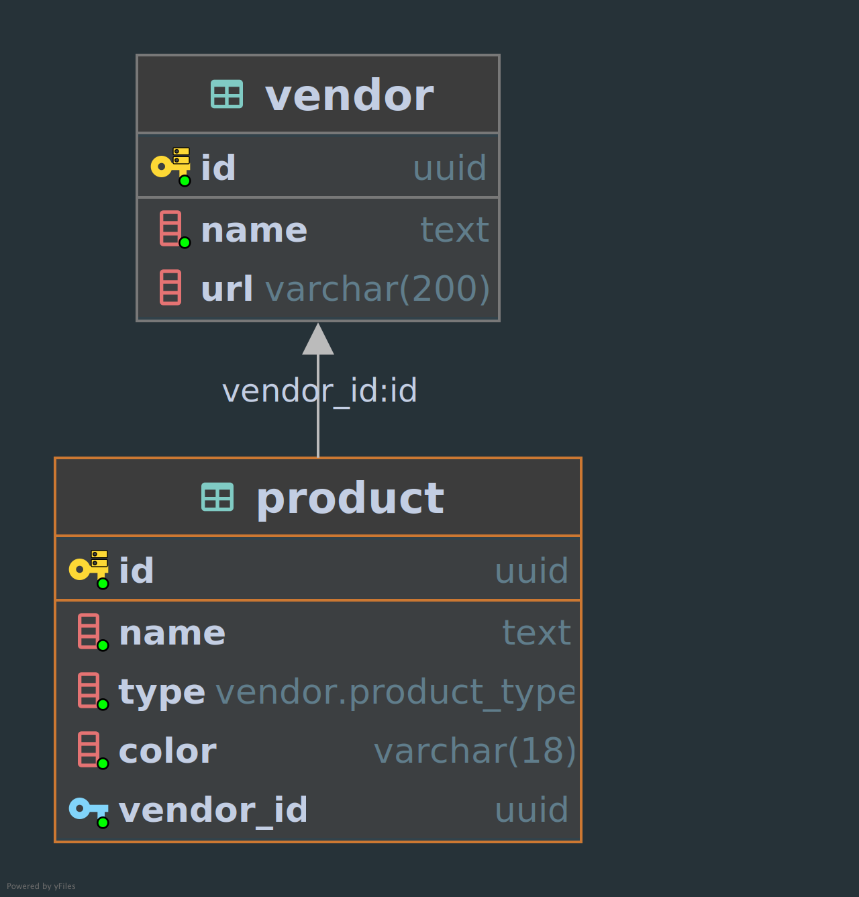

# How to install

---

## Preparations

Install Docker and Docker compose

---

## How to run docker-compose

1. Create .env file in docker-compose directory (or rename .env.example)

2. Fill .env file with the following variables:

   - `DB_NAME` = name of the database
   - `DB_USER` = name of db user
   - `DB_PASSWORD` = db password
   - `DB_HOST` = host of db
   - `DB_PORT` = port of db
   - `ADMIN_PANEL_SECRET_KEY` = secret key for admin panel
   - `ADMIN_PANEL_DEBUG` = enable of disable debug mode for admin panel
   - `ADMIN_PANEL_DB_URL` = url for vendor_db for admin panel
   - `ADMIN_PANEL_PORT` = exposed port for admin panel (delete for production)
   - `VENDOR_DB_URL` = url for vendor_db for vendor api service (async)
   - `VENDOR_DB_AUTH_SCHEMA` = schema of vendor_db for vendor api service
   - `VENDOR_PORT` = exposed port for the vendor service (delete for production)

3. Run `docker compose up` in the backend repository folder

4. To create superuser for admin_panel run in the admin_panel folder
   `python manage.py createsuperuser`

5. To create mock data in the vendor_db run in the admin_panel folder
   `python manage.py gen_data`

## Service architecture

---

## Database architecture

---

## API specification

[see openapi here](./docs/openapi/api.md)

Or you can use `http://127.0.0.1:8000/api/openapi` when the vendor service is up
