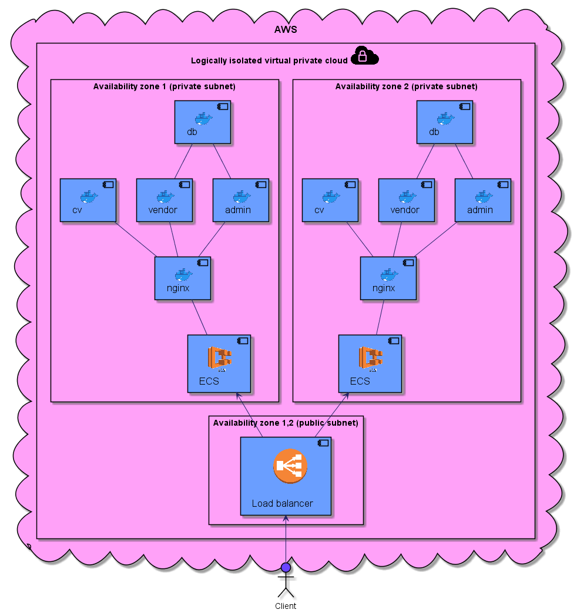

# AWS TonalCreamAssistant Architecrute

First revision architecrute 

## Terraform solution which creates a whole environment. The following resources are created

- Amazon ECS cluster utilizing EC2 provider for managing services
- ECS task definitions for admin_panel vendor and cv services
- Application load balancer
- EC2 instance for managing containers
- IAM Roles for the above components
- Security groups
- VPC and subnets
